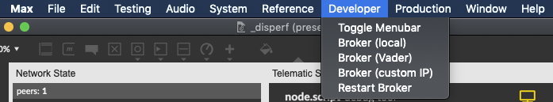
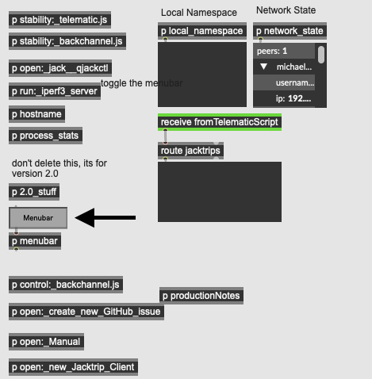

# Developer

Chances are, you will want to ignore this menu item, unless you are contributing to development of Disperf, or have forked the repo and are working on your own version.

1. Toggle Menubar: Selecting this will disable the Disperf menubar, reverting back to the Max/MSP menu allowing you to edit the patcher. To re-enable the menubar, exit presentation mode in the main _disperf patch window and press the *Menubar* button near the bottom-left corner. When it is set to orange, it is turned on. 

	
	
2. Broker (local): If you are running the disperf broker locally, select this.

3. Broker (Vader): Only useful if you are a member of the Dispersion Lab

4. Broker (custom IP): If you or someone you know is running a broker somewhere in the world, click this and enter the IP address of that machine. 

5. Restart the selected broker. The public cloud version of the broker is enabled by default, so be careful with this selection. 
