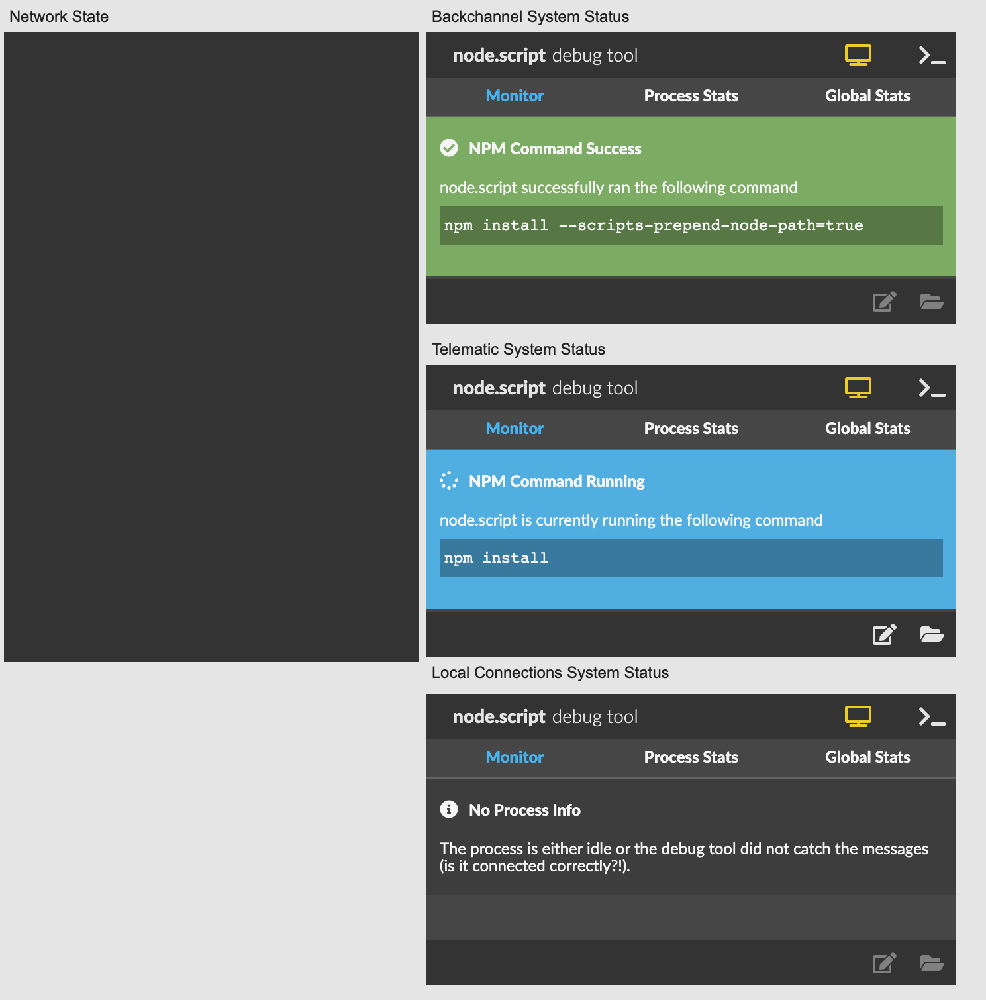
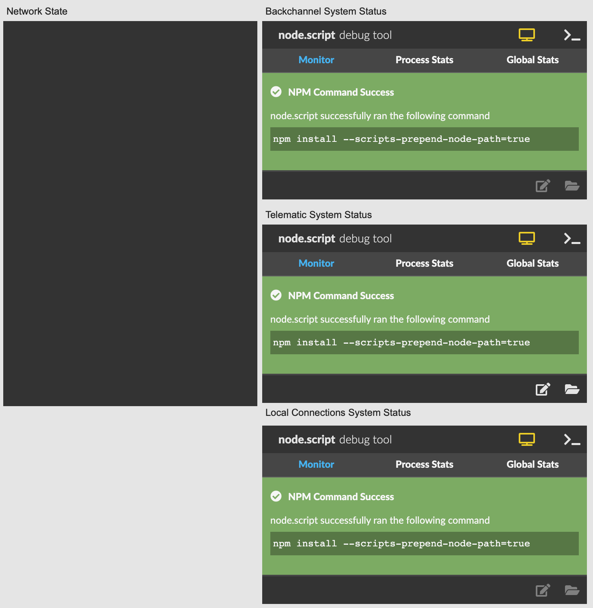

# Installation

Requirements:

- OSX (Works on Windows though not all features supported)
- Max/MSP 8


You can download Disperf as a release package [from here](

Or you can clone it from our repository: ```git clone https://github.com/dispersionlab/disperf```

1. Open the Max/MSP patch named **_disperf.maxpat**
2. In the menubar, navigate to *System > Install Disperf* which will install the dependencies for Disperf. This may take a while, but you can observe the progress by watching the three system status windows. Each will turn blue one at a time during the install:

	

3. Once all three have turned green the installation is completed:
	
	
4. Close the *_disperf.maxpat* for now. 
5. Install iperf3 using [this guide](https://iperf.fr/iperf-download.php)
6. Install Jack (you'll need to find the right one for your system), but [this might help](https://jackaudio.org/downloads/)
7. Install JackTrip using [this guide for OSX](https://ccrma.stanford.edu/software/jacktrip/osx/index.html) or [this guide for Windows](https://ccrma.stanford.edu/software/jacktrip/windows/index.html)
8. Restart your machine
9. Start *_disperf.maxpat* and return to the [homepage](https://dispersionlab.github.io/disperf) of this manual for other menu items. 


