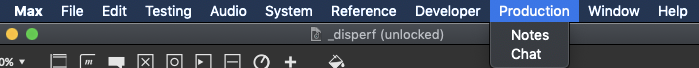

# Production
The production menu contains two tools useful for coordinating telematic concerts.

## Notes
The notes window will display any web page used for production notes. In our testing, we've used google docs and google sheets, and the following instructions are specific to adding a google doc or sheet (though you could skip *step 1* if you wanted to add a different web-based documentation source)

To load your doc/sheet into the Disperf Notes window:

1. In a web browser, open your sheet or doc, then go to **File>Publish to Web>choose 'website'** and copy that url. If we want to get just the spreadsheet data, for instance, choose 'csv' instead of website. 

2. Click the button *Add new doc or sheet*, and paste the url from step 1 into that field. 
3. The doc should load. The url will also be stored in the doc selection menu, and it will be stored locally in a file called *notes.txt*.

Caveat: The google sheet/doc is not editable in this window, you'll need to edit it within google docs itself. 

## Chat
We have integrated a Discord app into Disperf. 

1. You will need a discord user account (free), [join here](https://support.discord.com/hc/en-us/articles/360033931551-Getting-Started)
2. Once you have a discord account, join the Disperf Discord server using [this invite link](https://discord.gg/xgaEnaDBeC)
3. Now you can sign into your discord account through the Chat window. 

The disperf app will notify you when someone else connects using disperf, and you can use it to coordinate concerts between your peers. 
