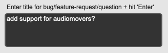
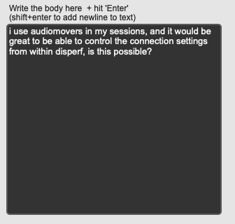
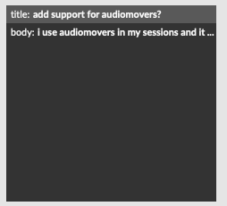

# Report a bug or request a feature

Disperf is a work in progress, and we appreciate any feedback. Please open the bug/feature reporter in *Reference > Report bug or request feature*

1. IMPORTANT: Please ensure that you are signed into GitHub first. You can sign in by [clicking here](https://github.com/login), then return to this page. 
2. After signing in, decide on a title for your bug report or feature request, enter it into the *Title* field, and hit enter. For example:

	
	
3. Describe the bug or feature in the field below. Try to be as specific as possible.
	
	
	
4. Verify the submission info in the panel to the right of the window

	
	
5. When ready, click *Send Issue*. This will open GitHub in your browser. Scroll to the bottom of the page and select the green button *Submit new issue*

	

