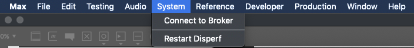

# System

Disperf uses a cloud server to maintain the list of connected peers and facilitate connection reqests. This server is named the **Broker**. 

1. **Connect to Broker**: Upon launch, Disperf will attempt to connect to the Broker, but if you were not connected to the internet at launch (or possibly for other undocumented reasons), this might fail. You can attempt another broker connection using this menu. 
2. **Restart Disperf**: This will trigger a reset to default settings and restart of any services running on your machine. 