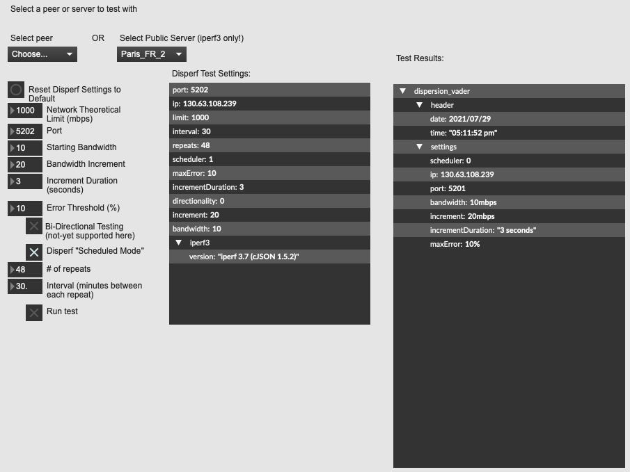
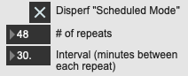
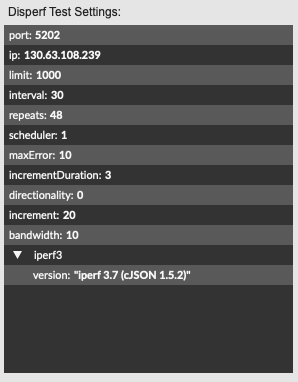
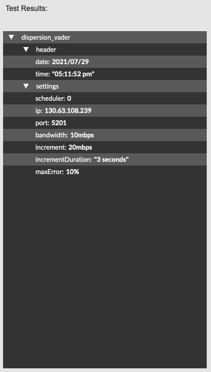
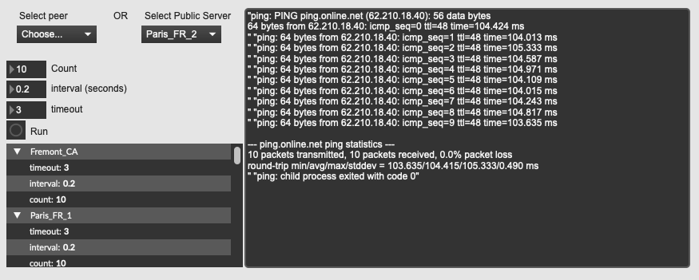
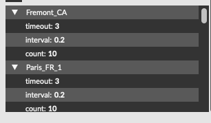
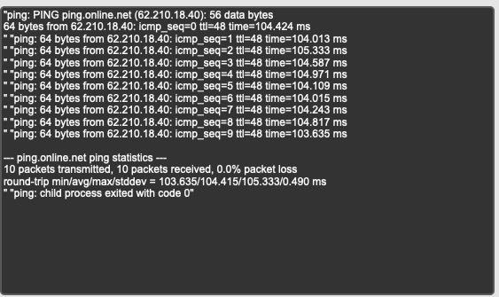

# Testing

Disperf can run several tests: Running iperf for bandwidth and QoS, and checking latency between peers. This page provides instructions for both modes. 

# Disperf

The Disperf test window allows you to run several useful bandwidth tests tests between your node and another on the network. The test will begin with an initial minimum bandwidth, and iterate subsequent tests of increasing bandwidth, returning packet loss, jitter, and other metrics at each interval. The test will end if either the loss threshold is met, or if the bandwidth increment reaches the theoretical limit. 

To access this window, go to the *Testing* menu and select *Disperf...*

 You can choose from a list of connected peers, or from a list of publicly hosted iperf3 servers. 

### Test with a connected peer. 

Choose a peer from the peer drop-down menu, then continue to the test instructions below. 

### Test against a public iperf server

We provide this option in case there are no connected peers during your session.

## Test Instructions

1. **Theoretical bandwidth limit**. This is whatever your ISP has stated as the maximum bandwidth for you internet package. Or, it could be what your hardware limit is. Default is set to 1000 mbps.
2. **Choose the port**. The default port for iperf is 5201.
3. **Starting bandwidth**. This is the amount that will be transmitted for the first test iteration. 
4. **Bandwidth Increment**: Set the amount that each subsequent test iteration should increase in bandwidth. 
5. **Increment Duration**: How long to transmit data for each iteration of the test. 
6. **Error threshold**: If an iteration returns a package loss percentage above this threshold, the test will end. 
7. **Bi-directional testing**. (forthcoming feature)
8. **Scheduled Mode**: with this feature enabled, an incremental test will be performed for a set amount of times ever nn minutes. In the Dispersion Lab, we would use this to capture network conditions between collaborators over the course of a week, for example. 
	
	
8. Confirm the test settings in the Disperf Test Settings window

	
9. Select *Run Test* to begin the disperf test. A dialog will appear, requesting you to set a filename and save location for the test results. 
10. In addition to being saved to a file, the test results will also appear in the results window:

	
	
## Latency

The latency test window provides a ping test interface between your node and any of the connected peers, or between your node and a publicly hosted iperf server. 

To access this window, go to the *Testing* menu and select *Latency*

### Test with a connected peer. 

Choose a peer from the peer drop-down menu, then continue to the test instructions below. 

### Test against a public iperf server

We provide this option in case there are no connected peers during your session.

## Test Instructions

1. **Count**: Choose the number of pings to send to the target.
2. **Interval**: How long to wait between pings
3. **timeout**: How long to wait for a response before exiting
4. Verify your settings in the settings window
	
5. Click run. The test results will print to the test results window:
	

